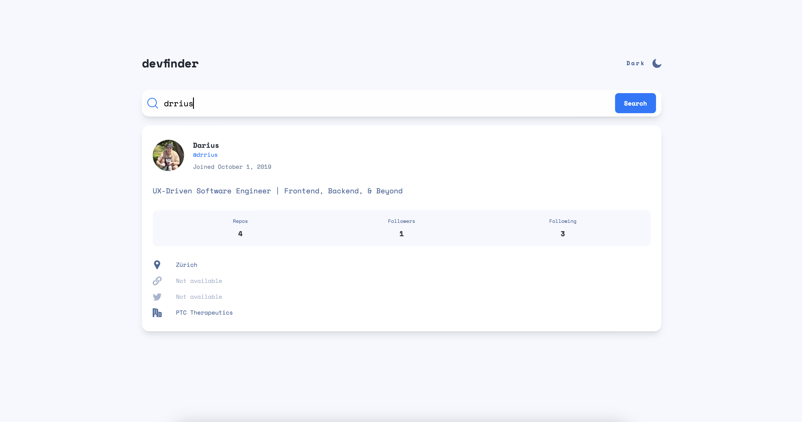

# Frontend Mentor - GitHub User Search App Solution

This repository contains my solution to the GitHub User Search App challenge on Frontend Mentor. This challenge provides an excellent opportunity to enhance coding skills through building a realistic and functional web application.

## Table of Contents

- [Frontend Mentor - GitHub User Search App Solution](#frontend-mentor---github-user-search-app-solution)
  - [Table of Contents](#table-of-contents)
  - [Overview](#overview)
    - [The Challenge](#the-challenge)
    - [Screenshots](#screenshots)
    - [Links](#links)
  - [My Process](#my-process)
    - [Built With](#built-with)
    - [What I learned](#what-i-learned)

## Overview

### The Challenge

Users should be able to:

- View the optimal layout for the app depending on their device's screen size
- See hover states for all interactive elements on the page
- Search for GitHub users by their username
- See relevant user information based on their search
- Switch between light and dark themes
- Bonus: Have the correct color scheme chosen for them based on their computer preferences. Hint: Research `prefers-color-scheme` in CSS.

### Screenshots



### Links

- [Live Site URL](https://github-user-search-nine-gamma.vercel.app)

## My Process

### Built With

- **Semantic HTML5** markup for robust structure
- **CSS custom properties** for design consistency
- **Flexbox** and **CSS Grid** for layout
- **Mobile-first workflow** for responsive design
- **React** for UI development
- **Next.js** for server-side rendering and static site generation
- **Tailwind CSS** for efficient styling
- **GitHub API** for fetching user data

### What I learned

One of the key challenges I faced was managing the dark mode toggle using Tailwind CSS. Tailwind requires manually injecting the `dark` class into the body’s class list to apply dark mode styles. Here’s how I handled it:

```javascript
// Function to toggle dark mode
const toggleDarkMode = () => {
  if (document.body.classList.contains("dark")) {
    document.body.classList.remove("dark");
  } else {
    document.body.classList.add("dark");
  }
};
```
